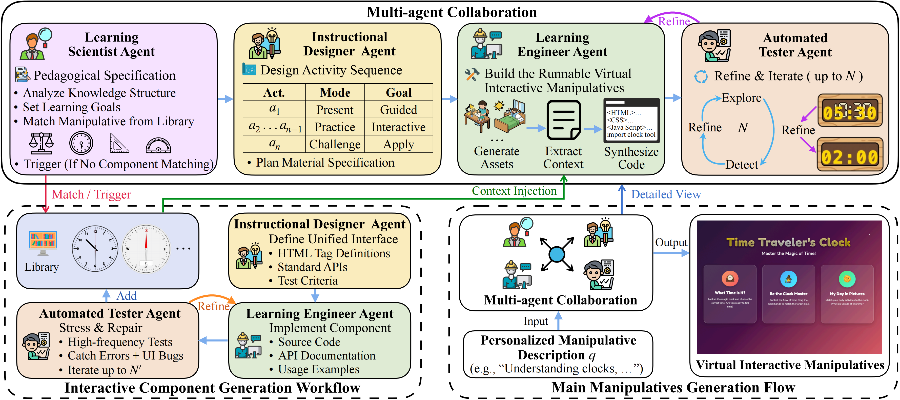

# ManipulativeAgent: A Collaborative Multi-Agent Framework for Interactive Mathematical Content Generation

_A Multi-Agent Framework for Automated Virtual Interactive Manipulatives Generation_

We present ManipulativeAgent, a multi-agent framework that automatically generates virtual interactive manipulatives from natural language descriptions. The system simulates professional educational development teams through four specialized agents: (1) **Learning Scientist Agent** for instructional needs analysis and component matching; (2) **Instructional Designer Agent** for progressive activity sequence design; (3) **Learning Engineer Agent** for material generation and code synthesis; and (4) **Tester Agent** for automated testing and iterative repair. The framework also includes a dynamically extensible **Virtual Manipulative Library** of reusable instructional tools.

---

## Overview

Virtual interactive manipulatives are web applications that integrate virtual mathematical tools with progressive instructional activities for elementary mathematics education. They face two key limitations: accessibility (teachers lack programming skills) and personalization (fixed templates cannot adapt to varied needs). Our framework addresses these challenges by providing an end-to-end generation experience from natural language to working manipulatives without requiring prompt engineering or programming expertise.

---

## Framework



Given a natural language description of teaching needs, the **Learning Scientist Agent** analyzes core concepts and matches components from the library; the **Instructional Designer Agent** designs progressive activities following the presentation-practice-challenge model; the **Learning Engineer Agent** generates materials and synthesizes code with component context injection; the **Tester Agent** validates correctness through task-guided exploratory testing and performs iterative repairs until quality thresholds are met.

---

## Performance

We conduct comprehensive evaluation through automated assessment and a frontline teacher survey.

### Automated Evaluation

We evaluate on a dataset of 40 teaching scenarios from real teacher search queries. A Visual LLM-based method automatically interacts with each manipulative and scores on four dimensions (1–5 scale).

| Dimension | Score | Description |
| :--- | :---: | :--- |
| **Visual Aesthetics** | 5 | Exquisitely designed, suitable for projection display, with clear visual guidance |
| | 3 | Tidy interface with clear divisions, though lacking distinction |
| | 1 | Obvious display errors rendering content unusable |
| | | |
| **Interaction Richness** | 5 | Rich active operations (drag, rotate, simulate) with immediate feedback |
| | 3 | Basic interactions (buttons, multiple choice) lacking depth |
| | 1 | No interaction or interactions unresponsive |
| | | |
| **Instructional Effectiveness** | 5 | Progressive activity design with diverse types supporting different stages |
| | 3 | Complete flow but only a single teaching activity |
| | 1 | Confused logic or serious pedagogical errors |
| | | |
| **Content Accuracy** | 5 | Completely accurate with comprehensive knowledge coverage |
| | 3 | Correct core concepts but partial omissions |
| | 1 | Serious subject matter errors |

| Method            | Visual Aesthetics | Interaction Richness | Instructional Effectiveness | Content Accuracy |
| ----------------- | ----------------: | -------------------: | --------------------------: | ---------------: |
| Feixiang Teacher  |              4.00 |                 2.57 |                        2.50 |             3.17 |
| Laoshibang        |              4.25 |                 2.66 |                        2.88 |             4.09 |
| Gemini 3.0 Pro    |              4.32 |                 2.80 |                        2.95 |             3.76 |
| Claude 4.5 Sonnet |              4.31 |                 2.83 |                        2.93 |             4.00 |
| **Ours**    |    **4.43** |       **3.88** |              **3.26** |   **4.12** |

> ManipulativeAgent outperforms commercial platforms and direct LLM generation on all dimensions. The largest gain is in **Interaction Richness** (3.88 vs 2.83), where the component library reduces interaction failures common in directly generated code.

### Teacher Survey (N=89)

89 frontline primary school mathematics teachers from 15 provinces evaluated 20 generated manipulatives.

| Dimension               |  Mean ± Std |
| ----------------------- | -----------: |
| Content Accuracy        | 4.31 ± 0.81 |
| Curriculum Alignment    | 4.21 ± 0.85 |
| Interactive Experience  | 4.51 ± 0.61 |
| Difficulty Breakthrough | 4.54 ± 0.60 |
| Ease of Use             | 4.25 ± 0.84 |
| Workload Reduction      | 4.42 ± 0.75 |

- **Acceptance Rate:** 92.2% of teachers expressed willingness to use these resources.
- **Key Takeaways:** Teachers rated "Difficulty Breakthrough" (4.54) and "Interactive Experience" (4.51) highest, indicating the generated manipulatives help students intuitively understand abstract concepts.

---

## Quick Start

### Prerequisites

- Python 3.10+
- Node.js 18+
- API keys for LLM services

### Installation

```bash
cd manipulative-agent-ui/manipulative-agent-ui

# Frontend dependencies
npm install

# Backend dependencies
cd server
pip install -r requirements.txt
```

### Running

**Start Backend:**

```bash
cd manipulative-agent-ui/manipulative-agent-ui/server
uvicorn main:app --host 0.0.0.0 --port 8000 --reload
```

**Start Frontend:**

```bash
cd manipulative-agent-ui/manipulative-agent-ui
npm run dev
```

Open `http://localhost:5173` in your browser.

---

## Project Structure

```text
manipulative-agent-ui/
├── README.md                            # This file
└── manipulative-agent-ui/               # Project root
    ├── package.json                     # Frontend dependencies
    ├── vite.config.ts                   # Vite configuration
    ├── src/                             # React Frontend implementation
    │   ├── components/                  # UI components
    │   ├── hooks/                       # Custom React hooks
    │   └── App.tsx                      # Main frontend application
    ├── server/                          # FastAPI Backend implementation
    │   ├── main.py                      # API entry point
    │   ├── session.py                   # State management & SSE
    │   ├── pipeline/                    # Agent pipeline implementation
    │   ├── services/                    # External module integrations
    │   └── prompts/                     # Agent system prompts
    ├── data/                            # Component mapping data
    └── public/                          # Static assets
```

---

## Demo Gallery

Coming soon: Demo videos showcasing generated virtual interactive manipulatives for various mathematical topics including clocks, protractor, parallelogram and more.

| Method | clock | Fraction Multiplication | parallelogram | protractor | renminbi |
| --- | --- | --- | --- | --- | --- |
| Feixiang Teacher | [fxls_clock](https://bingmengzi.github.io/demo.github.io/feixianglaoshi/fxls_clock.html) | [fxls_fractionMultiplication](https://bingmengzi.github.io/demo.github.io/feixianglaoshi/fxls_fractionMultiplication.html) | [fxls_parallelogram](https://bingmengzi.github.io/demo.github.io/feixianglaoshi/fxls_parallelogram.html) | [fxls_protractor](https://bingmengzi.github.io/demo.github.io/feixianglaoshi/fxls_protractor.html) | [fxls_renminbi](https://bingmengzi.github.io/demo.github.io/feixianglaoshi/fxls_renminbi.html) |
| Laoshibang | [lsb_clock](https://bingmengzi.github.io/demo.github.io/laoshibang/lsb_clock.html) | [lsb_fractionMultiplication](https://bingmengzi.github.io/demo.github.io/laoshibang/lsb_fractionMultiplication.html) | [lsb_parallelogram](https://bingmengzi.github.io/demo.github.io/laoshibang/lsb_parallelogram.html) | [lsb_protractor](https://bingmengzi.github.io/demo.github.io/laoshibang/lsb_protractor.html) | [lsb_renminbi](https://bingmengzi.github.io/demo.github.io/laoshibang/lsb_renminbi.html) |
| Gemini 3.0 Pro | [gemini_clock](https://bingmengzi.github.io/demo.github.io/gemini/gemini_clock.html) | [gemini_fractionMultiplication](https://bingmengzi.github.io/demo.github.io/gemini/gemini_fractionMultiplication.html) | [gemini_parallelogram](https://bingmengzi.github.io/demo.github.io/gemini/gemini_parallelogram.html) | [gemini_protractor](https://bingmengzi.github.io/demo.github.io/gemini/gemini_protractor.html) | [gemini_renminbi](https://bingmengzi.github.io/demo.github.io/gemini/gemini_renminbi.html) |
| Claude 4.5 Sonnet | [claude_clock](https://bingmengzi.github.io/demo.github.io/claude/claude_clock.html) | [claude_fractionMultiplication](https://bingmengzi.github.io/demo.github.io/claude/claude_fractionMultiplication.html) | [claude_parallelogram](https://bingmengzi.github.io/demo.github.io/claude/claude_parallelogram.html) | [claude_protractor](https://bingmengzi.github.io/demo.github.io/claude/claude_protractor.html) | [claude_renminbi](https://bingmengzi.github.io/demo.github.io/claude/claude_renminbi.html) |
| **Ours** | **[clock](https://bingmengzi.github.io/demo.github.io/ourMethod/clock/index.html)** | **[Fraction Multiplication](https://bingmengzi.github.io/demo.github.io/ourMethod/Fraction%20Multiplication/index.html)** | **[parallelogram](https://bingmengzi.github.io/demo.github.io/ourMethod/parallelogram/index.html)** | **[protractor](https://bingmengzi.github.io/demo.github.io/ourMethod/protractor/index.html)** | **[Renminbi](https://bingmengzi.github.io/demo.github.io/ourMethod/Renminbi/index.html)** |

---

## Video Demonstration

You can watch the full demonstration of the ManipulativeAgent framework in action. The video showcases the multi-agent collaboration process and features various examples of generating virtual mathematical interactives from natural language prompts.

[](https://youtu.be/Fc-XEzGGcJU)

*(Click the image above to watch the full demonstration video on YouTube, or view the [raw video file here](https://github.com/bingmengzi/CIKM_2026_demo_code/blob/main/vedio/ManipulativeAgent.mp4))*
