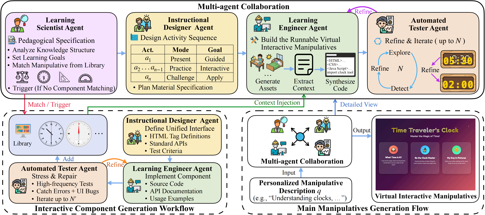

# ManipulativeAgent: A Multi-Agent System for GeneratingInteractive Mathematical Manipulatives

_A Multi-Agent Framework for Automated Virtual Interactive Manipulatives Generation_

We present ManipulativeAgent, a multi-agent framework that automatically generates virtual interactive manipulatives from natural language descriptions. The system simulates professional educational development teams through four specialized agents: (1) **Learning Scientist Agent** for instructional needs analysis and component matching; (2) **Instructional Designer Agent** for progressive activity sequence design; (3) **Learning Engineer Agent** for material generation and code synthesis; and (4) **Tester Agent** for automated testing and iterative repair. The framework also includes a dynamically extensible **Virtual Manipulative Library** of reusable instructional tools.

---

## Overview

Virtual interactive manipulatives are web applications that integrate virtual mathematical tools with progressive instructional activities for elementary mathematics education. They face two key limitations: accessibility (teachers lack programming skills) and personalization (fixed templates cannot adapt to varied needs). Our framework addresses these challenges by providing an end-to-end generation experience from natural language to working manipulatives without requiring prompt engineering or programming expertise.

---

## Framework



Given a natural language description of teaching needs, the **Learning Scientist Agent** analyzes core concepts and matches components from the library; the **Instructional Designer Agent** designs progressive activities following the presentation-practice-challenge model; the **Learning Engineer Agent** generates materials and synthesizes code with component context injection; the **Tester Agent** validates correctness through task-guided exploratory testing and performs iterative repairs until quality thresholds are met.

---

## Performance

We conduct comprehensive evaluation through automated assessment and a frontline teacher survey.

### Automated Evaluation

We evaluate on a dataset of 40 teaching scenarios from real teacher search queries. A Visual LLM-based method automatically interacts with each manipulative and scores on four dimensions (1–5 scale).

| Metric                                     | Score | Rubric description                                                                                                                                          |
| :----------------------------------------- | :---: | :---------------------------------------------------------------------------------------------------------------------------------------------------------- |
| **Visual Aesthetics (VA)**           |   5   | Exquisitely designed with a style suitable for elementary mathematics instruction, appropriate for projection display, and providing clear visual guidance. |
|                                            |   4   | Neat and aesthetically pleasing interface with harmonious color schemes suitable for teaching scenarios.                                                    |
|                                            |   3   | Tidy interface with clear functional divisions, though the design lacks distinction.                                                                        |
|                                            |   2   | Plain interface lacking visual appeal.                                                                                                                      |
|                                            |   1   | Obvious display errors rendering the content unusable.                                                                                                      |
| **Interaction Richness (IR)**        |   5   | Supports rich active operations such as dragging, adjusting, and physical simulation ,with immediate feedback.                                              |
|                                            |   4   | Diverse interaction forms allowing users to actively control the demonstration process and adjust parameters.                                               |
|                                            |   3   | Basic interactions such as buttons and multiple choice questions, though lacking depth of operation.                                                        |
|                                            |   2   | Primarily passive viewing where users can only control "next step" or "start demonstration".                                                                |
|                                            |   1   | No interaction or interactions are unresponsive.                                                                                                            |
| **Instructional Effectiveness (IE)** |   5   | Progressive instructional activity design with diverse activity types supporting different teaching stages.                                                 |
|                                            |   4   | Clear instructional logic with progressive difficulty levels.                                                                                               |
|                                            |   3   | Complete instructional flow though containing only a single teaching activity.                                                                              |
|                                            |   2   | Simple demonstration only, lacking hands-on practice components.                                                                                            |
|                                            |   1   | Confused instructional logic or serious pedagogical errors.                                                                                                 |
| **Content Accuracy (CA)**            |   5   | Completely accurate content with comprehensive knowledge point presentation, highly aligned with instructional requirements.                                |
|                                            |   4   | Accurate content meeting instructional needs, with possible minor imperfections.                                                                            |
|                                            |   3   | Correct core concepts, though with partial omissions or incomplete coverage.                                                                                |
|                                            |   2   | Obvious knowledge point omissions or inaccurate expressions.                                                                                                |
|                                            |   1   | Serious subject matter errors.                                                                                                                              |

> ManipulativeAgent outperforms commercial platforms and direct LLM generation on all dimensions. The largest gain is in **Interaction Richness** (3.88 vs 2.83), where the component library reduces interaction failures common in directly generated code.

| Method            | Visual Aesthetics | Interaction Richness | Instructional Effectiveness | Content Accuracy |
| ----------------- | ----------------: | -------------------: | --------------------------: | ---------------: |
| Feixiang Teacher  |              4.00 |                 2.57 |                        2.50 |             3.17 |
| Laoshibang        |              4.25 |                 2.66 |                        2.88 |             4.09 |
| Gemini 3.0 Pro    |              4.32 |                 2.80 |                        2.95 |             3.76 |
| Claude 4.5 Sonnet |              4.31 |                 2.83 |                        2.93 |             4.00 |
| **Ours**    |    **4.43** |       **3.88** |              **3.26** |   **4.12** |

### Teacher Survey (N=89)

89 frontline primary school mathematics teachers from 15 provinces evaluated 20 generated manipulatives.

| Dimension               |  Mean ± Std |
| ----------------------- | -----------: |
| Content Accuracy        | 4.31 ± 0.81 |
| Curriculum Alignment    | 4.21 ± 0.85 |
| Interactive Experience  | 4.51 ± 0.61 |
| Difficulty Breakthrough | 4.54 ± 0.60 |
| Ease of Use             | 4.25 ± 0.84 |
| Workload Reduction      | 4.42 ± 0.75 |

- **Acceptance Rate:** 92.2% of teachers expressed willingness to use these resources.
- **Key Takeaways:** Teachers rated "Difficulty Breakthrough" (4.54) and "Interactive Experience" (4.51) highest, indicating the generated manipulatives help students intuitively understand abstract concepts.

---

## Quick Start

### Prerequisites

- Python 3.10+
- Node.js 18+
- API keys for LLM services

### Installation

```bash
cd manipulative-agent-ui/manipulative-agent-ui

# Frontend dependencies
npm install

# Backend dependencies
cd server
pip install -r requirements.txt
```

### Running

**Start Backend:**

```bash
cd manipulative-agent-ui/manipulative-agent-ui/server
uvicorn main:app --host 0.0.0.0 --port 8000 --reload
```

**Start Frontend:**

```bash
cd manipulative-agent-ui/manipulative-agent-ui
npm run dev
```

Open `http://localhost:5173` in your browser.

---

## Project Structure

```text
E:\CIKM_2026_demo_code/
├── README.md                                  # This file
├── manipulative-agent-ui/                     # UI wrapper folder
│   └── manipulative-agent-ui/                 # Main UI & Backend Project root
│       ├── package.json                       # Frontend dependencies
│       ├── vite.config.ts                     # Vite configuration   
│       ├── tsconfig.json                      # TypeScript config
│       ├── src/                               # React Frontend implementation
│       │   ├── components/                    # UI components (Agent interface, ReviewPanel, etc.)
│       │   ├── hooks/                         # Custom React hooks
│       │   ├── mock/                          # Typed interfaces and mock data
│       │   ├── types/                         # TypeScript definitions
│       │   ├── lib/                           # Utility functions
│       │   └── App.tsx                        # Main frontend application component
│       ├── server/                            # FastAPI Backend implementation
│       │   ├── main.py                        # API entry point   
│       │   ├── session.py                     # State management & SSE handlers
│       │   ├── config.py                      # Configurations containing LLM setup
│       │   ├── pipeline/                      # Multi-Agent pipeline implementation
│       │   ├── services/                      # External module integrations
│       │   ├── routes/                        # External API routers layout
│       │   └── prompts/                       # Agent system prompts for each specialized agent
│       ├── data/                              # Component mapping data
│       ├── public/                            # Static assets and agent avatar icons
│       └── Agent_assest/                      # Specific avatar assets for Agents
├── demo/                                      # Demo outputs by various generation methods
│   ├── claude/, gemini/, etc...               # Competitor baseline demo outputs
│   └── ourMethod/                             # Outputs generated by our ManipulativeAgent
├── assets/                                    # Assets containing the framework images
├── image/                                     # Assorted images for metrics
└── video/                                     # Video demonstrations folder
```

---

## Demo Gallery

Coming soon: Demo videos showcasing generated virtual interactive manipulatives for various mathematical topics including clocks, protractor, parallelogram and more.

| Method            | clock                                                                                  | Fraction Multiplication                                                                                                      | parallelogram                                                                                          | protractor                                                                                       | renminbi                                                                                     |
| ----------------- | -------------------------------------------------------------------------------------- | ---------------------------------------------------------------------------------------------------------------------------- | ------------------------------------------------------------------------------------------------------ | ------------------------------------------------------------------------------------------------ | -------------------------------------------------------------------------------------------- |
| Feixiang Teacher  | [fxls_clock](https://bingmengzi.github.io/demo.github.io/feixianglaoshi/fxls_clock.html)  | [fxls_fractionMultiplication](https://bingmengzi.github.io/demo.github.io/feixianglaoshi/fxls_fractionMultiplication.html)      | [fxls_parallelogram](https://bingmengzi.github.io/demo.github.io/feixianglaoshi/fxls_parallelogram.html)  | [fxls_protractor](https://bingmengzi.github.io/demo.github.io/feixianglaoshi/fxls_protractor.html)  | [fxls_renminbi](https://bingmengzi.github.io/demo.github.io/feixianglaoshi/fxls_renminbi.html)  |
| Laoshibang        | [lsb_clock](https://bingmengzi.github.io/demo.github.io/laoshibang/lsb_clock.html)        | [lsb_fractionMultiplication](https://bingmengzi.github.io/demo.github.io/laoshibang/lsb_fractionMultiplication.html)            | [lsb_parallelogram](https://bingmengzi.github.io/demo.github.io/laoshibang/lsb_parallelogram.html)        | [lsb_protractor](https://bingmengzi.github.io/demo.github.io/laoshibang/lsb_protractor.html)        | [lsb_renminbi](https://bingmengzi.github.io/demo.github.io/laoshibang/lsb_renminbi.html)        |
| Gemini 3.0 Pro    | [gemini_clock](https://bingmengzi.github.io/demo.github.io/gemini/gemini_clock.html)      | [gemini_fractionMultiplication](https://bingmengzi.github.io/demo.github.io/gemini/gemini_fractionMultiplication.html)          | [gemini_parallelogram](https://bingmengzi.github.io/demo.github.io/gemini/gemini_parallelogram.html)      | [gemini_protractor](https://bingmengzi.github.io/demo.github.io/gemini/gemini_protractor.html)      | [gemini_renminbi](https://bingmengzi.github.io/demo.github.io/gemini/gemini_renminbi.html)      |
| Claude 4.5 Sonnet | [claude_clock](https://bingmengzi.github.io/demo.github.io/claude/claude_clock.html)      | [claude_fractionMultiplication](https://bingmengzi.github.io/demo.github.io/claude/claude_fractionMultiplication.html)          | [claude_parallelogram](https://bingmengzi.github.io/demo.github.io/claude/claude_parallelogram.html)      | [claude_protractor](https://bingmengzi.github.io/demo.github.io/claude/claude_protractor.html)      | [claude_renminbi](https://bingmengzi.github.io/demo.github.io/claude/claude_renminbi.html)      |
| **Ours**    | **[clock](https://bingmengzi.github.io/demo.github.io/ourMethod/clock/index.html)** | **[Fraction Multiplication](https://bingmengzi.github.io/demo.github.io/ourMethod/Fraction%20Multiplication/index.html)** | **[parallelogram](https://bingmengzi.github.io/demo.github.io/ourMethod/parallelogram/index.html)** | **[protractor](https://bingmengzi.github.io/demo.github.io/ourMethod/protractor/index.html)** | **[Renminbi](https://bingmengzi.github.io/demo.github.io/ourMethod/Renminbi/index.html)** |

---

## Video Demonstration

You can watch the full demonstration of the ManipulativeAgent framework in action. The video showcases the multi-agent collaboration process and features various examples of generating virtual mathematical interactives from natural language prompts.

[](https://youtu.be/7eclhXhRy0A)

*(Click the image above to watch the full demonstration video on YouTube, or view the [raw video file here](https://github.com/bingmengzi/CIKM_2026_demo_code/blob/main/video/ManipulativeAgent.mp4))*
